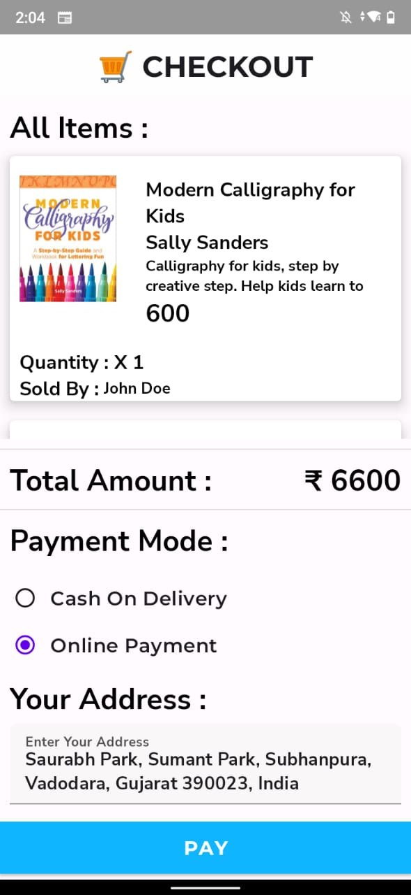

# BookStore - Online Book Store App to Purchase Books

## App Features

- **Theme** - Supports Both Light Mode and Dark Mode.
- **User Authentication** - Supports email based authentication
- **Browse Books** - Browse Through a wide range of books.
- **Search Books** - Search Through All Books
- **Sort Books** - Sort Books alphabetically from a to z or z to a OR Sort Books from Highest to Lowest or vice-versa
- **Cart** - Add All Books in Cart for further Processing
- **Checkout** - Select Payment Option Between Online Mode and Offline Mode ( Cash on Delivery )
- **History and Order** - Browse Through all your history and orders.

## 📸 Screenshots ( In Dark Mode )

|   |   |   |
|---|---|---|
|||
|||
|||
|||
|||
|||

## 📸 Screenshots ( In Light Mode )

|   |   |   |
|---|---|---|
|  |   | 
| |   | 
|  |   | 
| |  | 
| |  | 
| |  | 

## Built With 🛠
- [Kotlin](https://kotlinlang.org/) - First class and official programming language for Android development.
- [Coroutines](https://kotlinlang.org/docs/reference/coroutines-overview.html) - For All Asynchronous operations in project
- [Android Architecture Components](https://developer.android.com/topic/libraries/architecture) - Collection of libraries that help you design robust, testable, and maintainable apps.
  - [ViewModel](https://developer.android.com/topic/libraries/architecture/viewmodel) - Stores UI-related data that isn't destroyed on UI changes. 
  - [RoomDB](https://developer.android.com/training/data-storage/room) - Abstraction layer over SQLite to allow fluent database access while harnessing the full power of SQLite
  - [ViewBinding](https://developer.android.com/topic/libraries/view-binding) - Generates a binding class for each XML layout file present in that module and allows you to more easily write code that interacts with views.
  - [LiveData](https://developer.android.com/topic/libraries/architecture/livedata) - LiveData is an observable data holder class. Unlike a regular observable, LiveData is lifecycle-aware, meaning it respects the lifecycle of other app components, such as activities, fragments, or services.
  - [Navigation Component ](https://developer.android.com/guide/navigation) - Allows to specify navigation throughout app using an XML graph or via a graph editor.
- [Dependency Injection](https://developer.android.com/training/dependency-injection) 
  - [Dagger-Hilt](https://dagger.dev/hilt/) - Hilt provides a standard way to use DI in your application by providing containers for every Android class in your project and managing their lifecycles automatically
- [GSON](https://github.com/google/gson) - A modern JSON library for Kotlin and Java.
- [Retrofit](https://square.github.io/retrofit/) - A type-safe HTTP client for Android and Java.
- [GSON Converter](https://github.com/square/retrofit/tree/master/retrofit-converters/gson) - A Converter which uses Gson for serialization to and from JSON.
- [Glide](https://github.com/bumptech/glide) - An image loading library for Android
- [Material Components for Android](https://github.com/material-components/material-components-android) - Material Components are a set of UI components that helps you build Android apps with Material Design
- [RazorPay](https://razorpay.com/docs/payments/payment-gateway/android-integration/standard) - Razorpay Payments provides a number of solutions to help accept payments.

